# TAnoGAN

## Introduction

Over the past few years, the number of Internet of Things (IoT) devices grew substantially, and since such devices are equipped with sensors acquiring data over long periods of time, we are faced with huge amounts of time series data that can be used to improve many sectors of industry.

With such growth of sequential data, time series analysis gained much interest among researchers. More specifically, researchers are putting efforts in creating deep learning methods to perform different applications in time series analysis [1]. One such application is time series anomaly detection.

Anomaly detection represents detecting outliers or irregularities from a dataset, which, depending on the scenario, may indicate malfunction of a system, fraud, occurence of a rare event etc. There are three categories of anomaly detection techniques: supervised learning, semi-supervised learning and unsupervised learning. Supervised learning methods require labelled data, which in most cases labels are not available or the dataset is highly unbalanced, since it is very difficult and costly to obtain anomalous samples. Semi-supervised learning consists in training a model on normal data only in order to model a distribution over the normal behaivour and test it on both normal and anomalous data. A sample is labelled anomalous depending on how far out of the distribution it is. Unsupervised learning represents extracting knowledge from unlabelled data.

The aim of this project is to investigate and implement some of the current state-of-the-art deep learning methodologies for time series anomaly detection and compare them against a Bayesian-based Multylayer Perceptron developed during one of the laboratories during the semester.

The dataset used in our experiments consists of multivariate time series data gathered from the sensors of a Kuka robotic arm.

## Background

Many methodologies for anomaly detection have been developed over the years and more recently, the focus has been on deep learning methodologies. Some methodologies are based on recurrent neural networks (RNNs), since time series data is sequential by nature and it is straightforward to assume that current events depend on past events.

Other methodologies have been adapted from the field of computer vision, such as Convolutional Neural Networks (CNNs), Autoencoders and Generative Adversarial Networks (GANs).

Lastly, some graph-based methods have been developed for time series anomaly detection.

## Materials and Methods

Our models have been trained and tested on Kuka robotic arm dataset. A sample in this dataset consists of over 50 features. The dataset consists of 5 recordings (titled rec1, rec2, ..., rec5), among which two of them (rec1 and rec5) contain anomalies at different time intervals caused by collisions of the robotic arm with other objects in the lab.

We also went on to train and test some of the methodologies on SWaT [2] dataset (courtesy to iTrust, the Cyber Security research group at the Singapore University of Technology and Design, for sharing the dataset with us). SWaT (Secure Water Treatment) dataset is obtained from an industrial water treatment plant, where the authors accumulated time series data on both physical and network aspects of the plant and they performed various attacks on it. They recorded time series both under normal scenarios and during attacks. We trained and tested our model on the recordings performed on December 2015 on the physical properties.

### Bayesian MLP

Bayesian MLP (Multilayer Perceptron) was presented during one of the laboratories. The term "Bayesian" indicates the fact that the model weights are not point estimate values. Instead, the weights of the model are described by a probability distribution function (PDF). Doing so gives the network a way to tell how certain it is about the inference it made on a sample.

In Bayesian MLP, MC dropout (Monte Carlo dropout) technique [3] is used to approximate the PDF describing the weigths of the model. MC stands for the fact that the distribution of the weights is sampled multiple times. What is happening is that, after finishing training the network, dropout is kept enabled also during inference, i.e. during inference, some nodes within each layer are switched off. This has the effect that when feeding the same input to the network multiple times will give a different output each time. This is the key factor in the anomaly detection capability of this model. Depending on how much the outputs for the same input differ, the input is labelled as normal or anomalous. For example, if the outputs differ a lot, it means that the network is uncertain about the class to which the input belongs to, and so it could mean that the input is actually out-of-distribution of the training set, and so it can be considered an anomaly.

The uncertainty (or confidence) is quantified in three ways: by computing the variance, entropy or the maximum softmax response. First, the network gives $N$ softmax outputs for the same input. Then, the outputs are averaged and finally, either variance, entropy or maximum softmax response is computed among the features of the averaged softmax outputs.

Unlike some of the methodologies we implemented in this project, the Bayesian MLP makes use of the metadata that comes with the Kuka dataset which provides information about what action the robot is performing during a time interval. Before training, the time series are divided in windows containing timestamps all falling in the same action interval and then the TSFEL [4] library is used for extracting statistical features for each window. So, Bayesian MLP is trained for classifying the input by telling which action it believes the robot is making and the uncertainty of the decision is what is being used for anomaly detection.

### TAnoGAN and ModifiedTAnoGAN

As the name suggests, TAnoGAN [5] is a GAN-based methodology for anomaly detection and it follows a semi-supervised approach, i.e. the model is trained on normal data only. The generator learns a distribution describing the normal data.

Like in any GAN method, TAnoGAN consists of two networks: a generator and a discriminator. The generator, given a noise (latent) value, must generate time windows (i.e. subset of samples) that are as realistic as possible, to make it seem as if they were drawn from the same distribution as the normal (non-anomalous) data. The discriminator must learn how to distinguish between a real data coming from the normal samples and the fake data generated by the generator. These two networks are trained simultaneously, in an adversarial way, i.e. one is minimizing the objective function, while the other is maximizing the same objective function. This process is done until no improvement on both sides is seen.

In order to keep some memory on the past samples that were seen, the generator and discriminator consist of LSTM (Long-Short Term Memory) layers. The generator consists of three LSTM layers with 32, 64 and 128 hidden units respectively, and a dense layer. The discriminator has one LSTM layer with 100 hidden units and a dense layer.

To perform anomaly detection, TAnoGAN uses an anomaly score that is computed for every test time window and based on whether the score is higher or lower than a certain threshold, the time window is considered anomalous or normal, respectively. During inference, the input time window is mapped to the latent space and then back to the original space and the anomaly score is the loss due to going back and forth between the two spaces. The anomaly score has two parts: residual loss and discrimination loss.

Residual loss:
$$R(x)=\sum |x-G(z_\lambda)|$$

measures the point-wise dissimilarity between the time window $x$ and its reconstruction $G(z_\lambda)$ by the generator from the latent variable $z_\lambda$.

Discrimination loss:
$$D(x)=\sum |f(x)-f(G(z_\lambda))|$$

is computed as the difference between the outputs of the LSTM layer of the discriminator, when $x$ and $G(z_\lambda)$ are given as input.

Finally, the anomaly score is computed as the weighted sum of residual and discrimination loss.

$$ A(x)=(1-\gamma)\cdot R(x) + \gamma \cdot D(x) $$

One important aspect about TAnoGAN is that during inference, the time windows to be classified as anomalous or normal are mapped to the latent space, but the architecture does not have a direct way to map from the original space to the latent one, i.e. there is no inverse function $G^{-1}(x)$ to the function represented by the generator $G(z)$ that is responsible for mapping latent variables to the space of the normal (non-anomalous) time windows. What the authors decided to do is to draw randomly a value $z$ and perform gradient descent on it for a number of times defined by $\lambda$ such that $G(z)$ is close to $x$. In our experiments we noticed that this process is extremely slow. It takes much longer to perform inference than to train the actual model.

We decided to add a modification to the original TAnoGAN architecture to mitigate this problem. Instead of performing gradient descent to map time windows to the latent space, we decided to design and train an encoder that learns the inverse mapping $G^{-1}(x)$ of the generator. So, now we have an autoencoder where we have an encoder and the generator that acts as a decoder. The decoder (generator) is trained in an adversarial fashion against the discriminator, and the encoder is trained like in a classical autoencoder (i.e. encoding and decoding an input and performing weight updates depending on the loss), however only the encoder is updated, leaving the weights of the decoder (generator) frozen. We named this modified architecture ModifiedTAnoGAN.

Both TAnoGAN and ModifiedTAnoGAN were trained and tested on the Kuka robotic arm dataset and we went further to train and test ModifiedTAnoGAN on the SWaT dataset.

## Results and discussion

In this section we report the performance results of all the methodologies implemented measured primarly by F1 score, Precision, Recall and ROC curves.

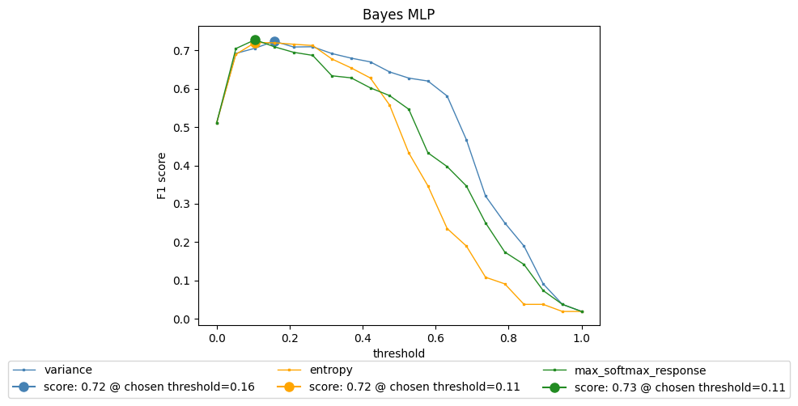

Fig 1.1. Bayesian MLP F1 score

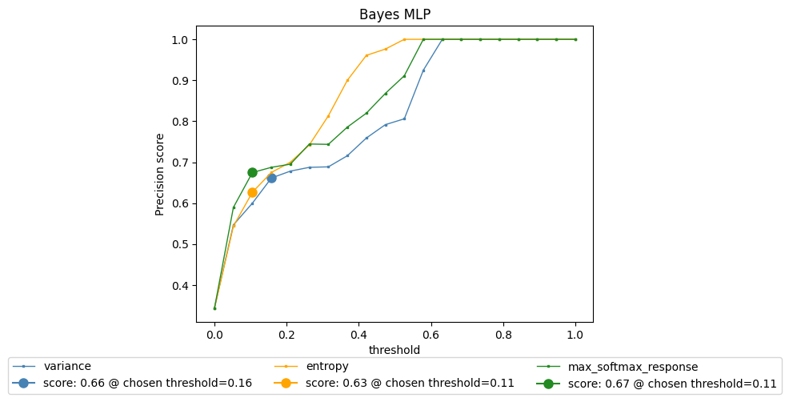

Fig 1.2. Bayesian MLP precision score

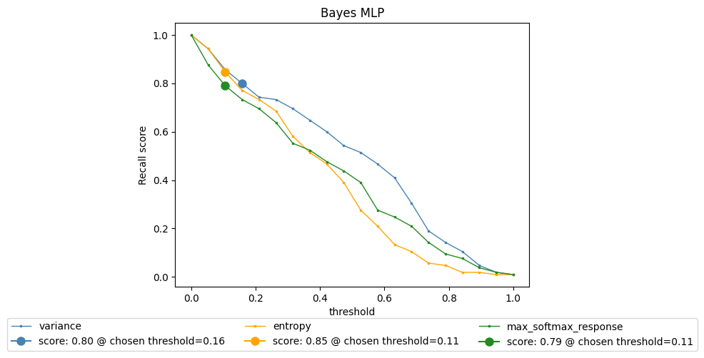

Fig 1.3. Bayesian MLP recall score

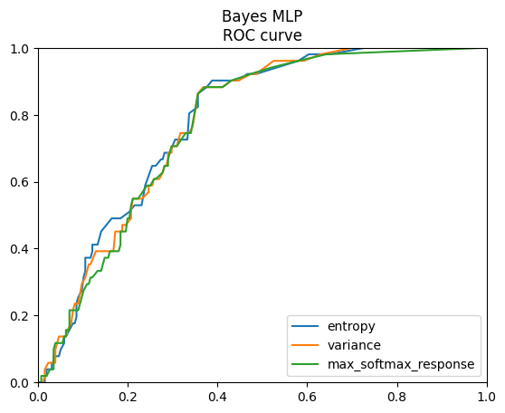

Fig 1.4. Bayesian MLP ROC curve

| uncertainty type |      f1      |  precision | recall |
|----------|:-------------:|------:|---:|
| variance |  0.68 | 0.62 | 0.75 |
| entropy |    0.70   |   0.74 | 0.67 |
| max softmax response | 0.68 | 0.64 | 0.73 |

Table 1

### TAnoGAN and ModifiedTAnoGAN

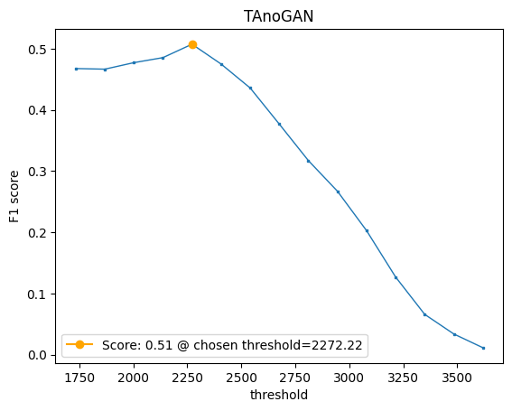

Fig 2.1. TAnoGAN f1 score

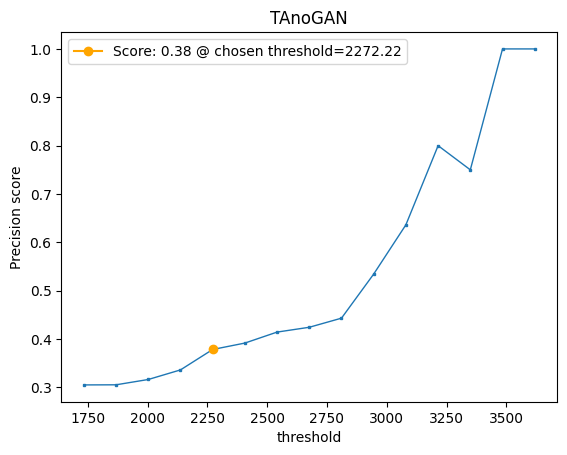

Fig 2.2. TAnoGAN precision score

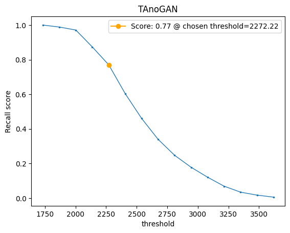

Fig 2.3. TAnoGAN recall score

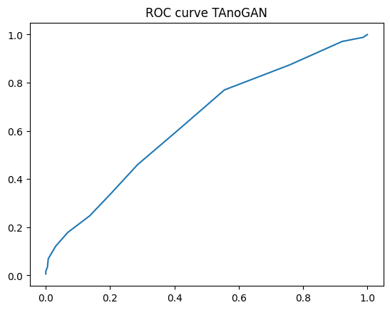

Fig 2.4. TAnoGAN ROC curve

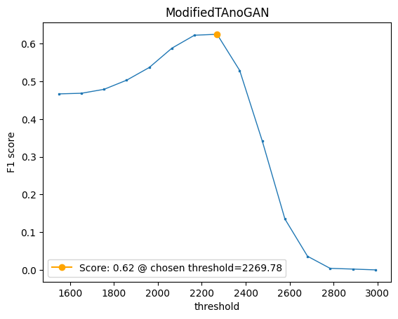

Fig 3.1. ModifiedTAnoGAN f1 score

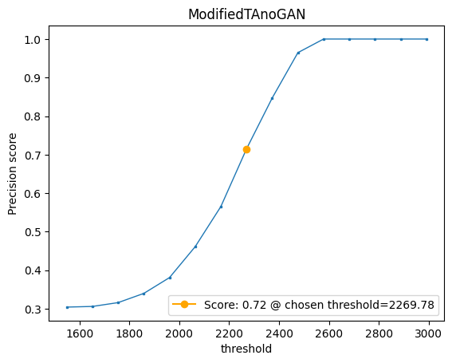

Fig 3.2. ModifiedTAnoGAN precision score

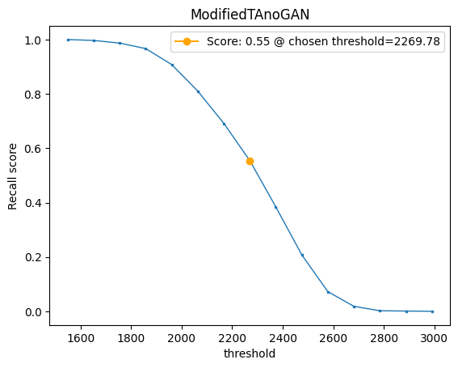

Fig 3.3. ModifiedTAnoGAN recall score

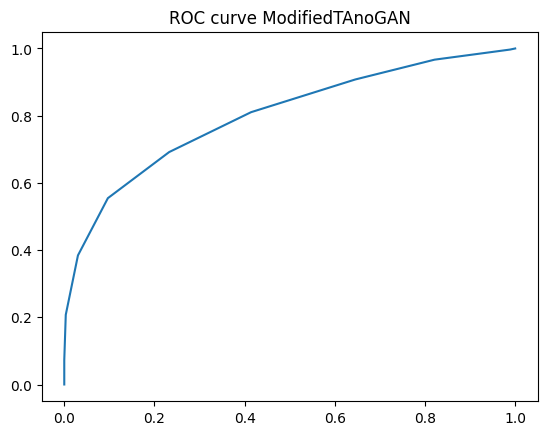

Fig 3.4. ModifiedTAnoGAN ROC curve

As mentioned in the previous section, TAnoGAN uses gradient descent to map time windows to the latent space, which makes the process of anomaly detection extremely slow. In our experiments, performing inference took twice the time of training the model. Also, we noticed that during gradient descent, the loss between the input time window and its reconstruction from latent space was barely decreasing, which led to the poor results reported in Figures 2.1 to 2.4. This motivated us to design a dedicated encoder for learning the mapping function from the original space to the latent space and add it to the original architecture to obtain the improved ModifiedTAnoGAN.

As it can be seen in Figures 2.1 and 3.1, ModifiedTAnoGAN gained a significant 11% improvement in F1 score over the original architecture. TAnoGAN, at the optimal threshold value highlighted in orange, has a better recall score, however it comes with the cost of having a very low precision score of 0.38. Besides performing better than the original architecture, ModifiedTAnoGAN works much faster during anomaly detection, being able to label all time windows in the test set in a matter of minutes, unlike TAnoGAN, which works in a matter of hours.

| architecure |     f1       |  precision |  recall |
|----------|:-------------:|------:|------:|
| TAnoGAN |  0.51 | 0.38 | 0.77 |
| ModifiedTAnoGAN |    0.62   | 0.72 | 0.55 |

Table 2

Even though ModifiedTAnoGAN sees marginal improvements over the original architecture, it still has lower performance compared to Bayesian MLP. We susupect that this is because Bayesian MLP was trained in a supervised way, since it learns how to classify time windows in terms of the action the robot is performing. TAnoGAN is trained in a semi-supervised way, since it is trained on non-anomalous data only and sees no information about what action the robot was doing at the given time window.

Also, we noticed that both TAnoGAN and ModifiedTAnoGAN see significantly different performance results when testing on rec1 and rec5 separately. On rec5, TAnoGAN and ModifiedTAnoGAN have f1 scores of 0.63 and 0.72, respectively. Whereas, on rec1, TAnoGAN and ModifiedTAnoGAN have f1 scores of 0.31 and 0.40, respectively. Given this and the overall results obtained on Kuka dataset, we decided to further investigate this on the SWaT dataset.

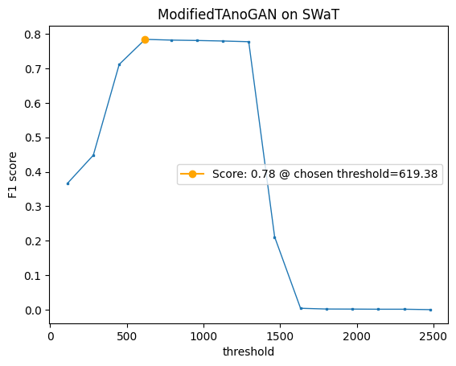

Fig 4.1. ModifiedTAnoGAN on SWaT f1 score

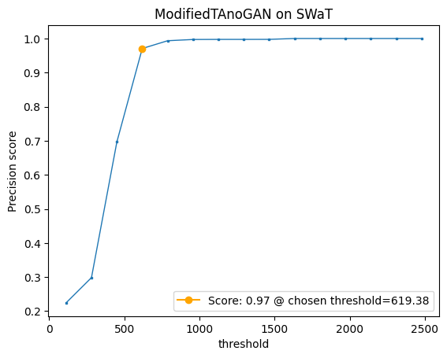

Fig 4.1. ModifiedTAnoGAN on SWaT precision

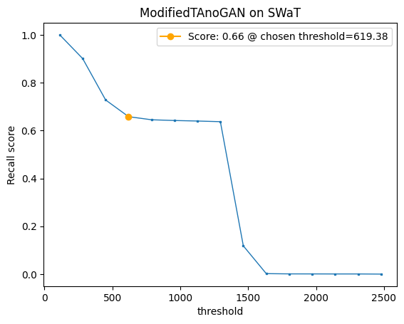

Fig 4.1. ModifiedTAnoGAN on SWaT recall

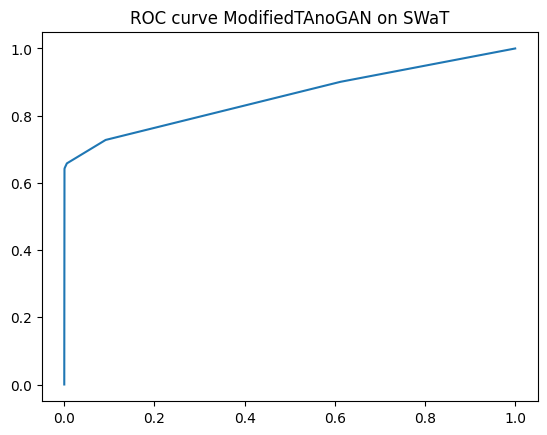

Fig 4.1. ModifiedTAnoGAN on SWaT f1 score

On the SWaT dataset, for the most optimum threshold, we obtained a f1 score of 0.78, 0.97 precision and 0.66 recall. These are much better results than the ones obtained on Kuka dataset. One thing that can be noticed, however, is that on both Kuka and SWaT datasets, ModifiedTAnoGAN has somewhat low recall scores of 0.55 and 0.66, respectively. It seems that ModifiedTAnoGAN is not able to detect particular types of anomalies, especially if we look at the results obtained on SWaT. A precision of 0.97 and recall of 0.66 might indicate that it might not be able to identify certain types of anomaly, but the ones it does, it identifies them with very high precision, with an insignificant number of false positives.

## References

[1] SCHMIDL, Sebastian; WENIG, Phillip; PAPENBROCK, Thorsten. Anomaly detection in time series: a comprehensive evaluation. Proceedings of the VLDB Endowment, 2022, 15.9: 1779-1797.

[2] Goh J., Adepu S., Junejo K. N., and Mathur A., “A Dataset to Support Research in the Design of Secure Water Treatment Systems,” The 11th International Conference on Critical Information Infrastructures Security.

[3] Dropout as a Bayesian Approximation: Representing Model Uncertainty in Deep Learning (Gal et al., 2016)

[4] https://tsfel.readthedocs.io/en/latest/

[5] Md Abul Bashar and Richi Nayak. 2020. TAnoGAN: Time Series Anomaly Detection with Generative Adversarial Networks.arXiv: 2008.09567 [cs, stat]. Retrieved from http://arxiv.org/abs/2008.09567.
